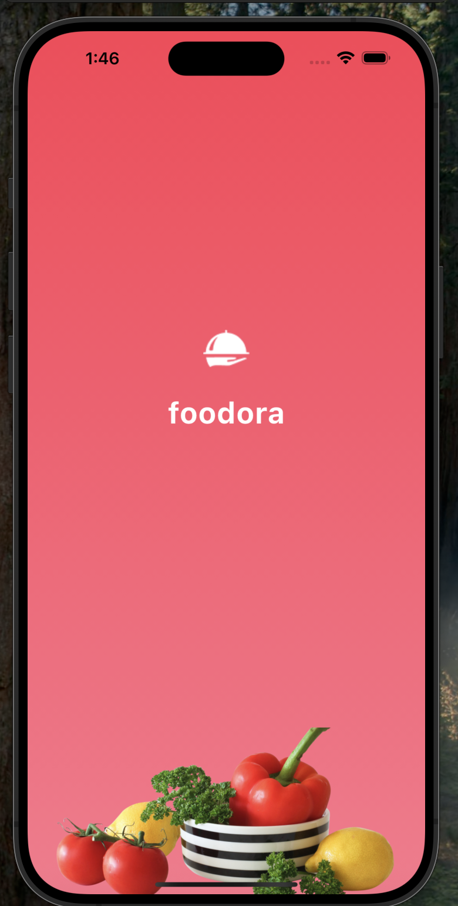
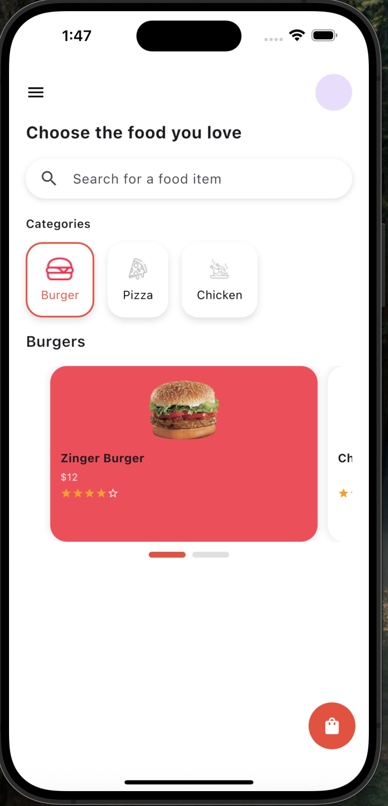
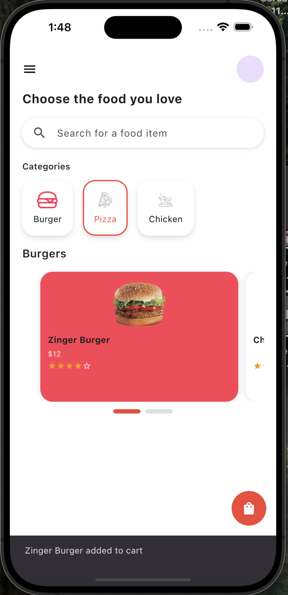

# 🍔 Foodora App UI (Flutter)

A clean and interactive food ordering app UI built with Flutter.  
This project replicates the **Foodora app design** using Figma as reference.

---

## 📱 Screens Included

- ✅ Welcome Screen (Splash)
- ✅ Auth Screen (Login / Sign Up toggle)
- ✅ Dashboard Screen
  - Category Tabs
  - PageView for popular food
  - Search Bar
  - Floating Action Button
- ✅ BottomSheet for food details
- ✅ AlertDialog for cart confirmation

---

## 🔧 Features and Concepts (Simplified)

- Easy navigation using named routes  
- Welcome screen appears for 5 seconds, then auto-navigates to login  
- Horizontal scrolling for food categories  
- Swipe between food cards using `PageView`  
- Bottom sheet shows food details when tapping a card  
- Alert dialog appears when adding item to cart  
- Clean and organized UI with modern design  
- Smooth scrolling experience (like iOS)

---

## 🔧 Getting Started

1. Clone the repository:
   ```bash
   git clone https://github.com/Ameerah077/Foodora-App-UI.git
   ```
2. Navigate to project folder:
   ```bash
   cd foodora_app_flutter
   ```
3. Get dependencies:
   ```bash
   flutter pub get
   ```
4. Run the app:
   ```bash
   flutter run
   ```

---

## 📁 Folder Structure

```
lib/
├── main.dart
├── screens/
│   ├── welcome_screen.dart
│   ├── auth_screen.dart
│   └── dashboard_screen.dart
├── routes/
│   └── app_routes.dart
├── assets/
│   └── images/ (All UI assets)
```

---

## 📸 Screenshots

### 1. Welcome Screen


### 2. Log In Screen


### 3. Sign Up Screen


### 4. Dashboard Screen


### 5. AlertDialog (Add to Cart)


### 6. BottomSheet (Food Details)


### 7. Added to Cart Snackbar



## 👩‍💻 Auth

**Ameerah Aloufi**
